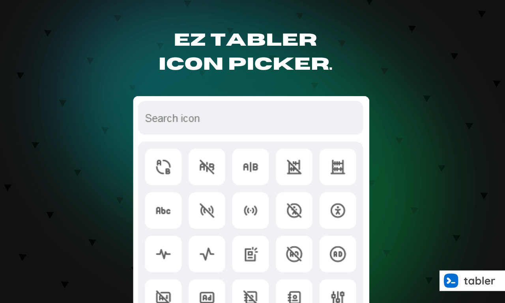

# EZ Fontawesome Icon Picker

A flexible, easy-to-use icon picker for Fontawesome Icons.



## Installation

Setup is straightforward:

1. Add **Fontawesome Icons** to your project.
2. Add **EZ Icon Picker** to your project.
3. Initialize EZ Icon Picker.

### Add the Required Files

Include the following links in your HTML file to load Fontawesome Icons and EZ Icon Picker:

```html
<!-- EZ Icon Picker CSS -->
<link rel="stylesheet" href="/dist/ez-icon-picker.css">

<!-- Fontawesome JavaScript -->
<script src="https://kit.fontawesome.com/38f33a5e76.js" crossorigin="anonymous"></script>
```

### Load EZ Icon Picker JavaScript

Add the following to load EZ Icon Picker:

```html
<!-- EZ Icon Picker JavaScript -->
<script src="/dist/ez-icon-picker.min.js" type="module"></script>
```

### Setup the Icon Picker

1.Add a div with a selector class, e.g., .icon-picker.

```html
<div class="icon-picker" data-name="icon"></div>
```

2.Initialize the picker by adding the following JavaScript:

``` javascript
<script>
    document.addEventListener('DOMContentLoaded', () => {
        new EzIconPicker({
            selector: '.icon-picker'
        });
    });
</script>
```

### Full Example Code

Here’s the complete HTML setup for the EZ Fontawesome Icon Picker:

``` html
<!DOCTYPE html>
<html lang="en">
<head>
    <!-- EZ Icon Picker CSS -->
    <link rel="stylesheet" href="/dist/ez-icon-picker.css">
    <title>Tabler Icon Picker</title>
</head>
<body>
    <!-- Icon Picker Element -->
    <div class="icon-picker" data-name="icon" data-icon="ti ti-home"></div>

    <!-- Fontawesome JavaScript -->
    <script src="https://kit.fontawesome.com/38f33a5e76.js" crossorigin="anonymous"></script>

    <!-- EZ Icon Picker JavaScript -->
    <script src="/dist/ez-icon-picker.min.js" type="module"></script>

    <script>
        document.addEventListener('DOMContentLoaded', () => {
            new EzIconPicker({
                selector: '.icon-picker'
            });
        });
    </script>
</body>
</html>
```

### Properties

`data-name` - Specifies the name of the input field, useful for form submissions.

`data-icon` - Allows pre-selecting an icon by specifying its class name

## Example Usage

To create an icon picker with a default icon, use the following code:

``` html
<div class="icon-picker" data-name="icon" data-icon="ti ti-home"></div>
```
